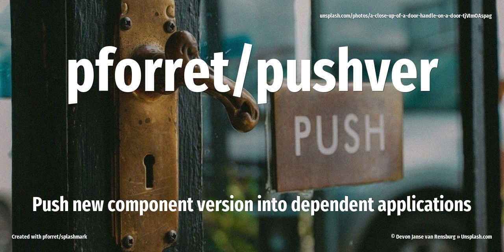

[](https://www.basher.it/package/)

# pforret/pushver



Push new version of component into projects that use it (currently only PHP/Composer)

## 🔥 Usage

```
Program : pushver  by peter@forret.com
Version : v0.1.0 (2025-01-07 10:50)
Purpose : Push new version of component into projects that use it
Usage   : pushver [-h] [-Q] [-V] [-f] [-L <LOG_DIR>] [-T <TMP_DIR>] [-B <BRANCH>] <action> <components?> <applications?>
Flags, options and parameters:
    -h|--help        : [flag] show usage [default: off]
    -Q|--QUIET       : [flag] no output [default: off]
    -V|--VERBOSE     : [flag] also show debug messages [default: off]
    -f|--FORCE       : [flag] do not ask for confirmation (always yes) [default: off]
    -L|--LOG_DIR <?> : [option] folder for log files   [default: log]
    -T|--TMP_DIR <?> : [option] folder for temp files  [default: .tmp]
    -B|--BRANCH <?>  : [option] branch to update  [default: main]
    <action>         : [choice] action to perform  [options: php,check,env,update]
    <components>     : [parameter] component repo(s) e.g. pforret/statistics_module (optional)
    <applications>   : [parameter] application(s) that use the component(s) and should be upgraded e.g. pforret/finixproject (optional)
                                                                                                                                                                                                                                                                     
### TIPS & EXAMPLES
* use pushver php to .push a new PHP component/library version into dependent applications (with composer)
  pushver php pforret/statistics_module pforret/finixproject
  pushver php pforret/module1,pforret/module2 pforret/project1,company/project2
* use pushver check to check if this script is ready to execute and what values the options/flags are
  pushver check
* use pushver env to generate an example .env file
  pushver env > .env
* use pushver update to update to the latest version
  pushver update
* >>> bash script created with pforret/bashew
* >>> for bash development, also check out pforret/setver and pforret/progressbar
```

## ⚡️ Examples

```bash
# you just updated your component <author/component> 
# and now you want your <author/project1> and <author/project2> to 'composer upgrade' to this latest version
pushver php "author/component" "author/project1,git@bitbucket.org:author/project2"
# will do the following steps for git@github.com:author/project1 and git@bitbucket.org:author/project2
# 1. git clone project
# 2. checkout the right branch
# 3. composer install
# 4. composer upgrade author/component
# 5. if there was an upgrade: git commit & git push
# 6. delete cloned project folder
```

## 🚀 Installation

with [basher](https://github.com/basherpm/basher)

	$ basher install pforret/pushver

or with `git`

	$ git clone https://github.com/pforret/pushver.git
	$ cd pushver

## 📝 Acknowledgements

* script created with [bashew](https://github.com/pforret/bashew)

&copy; 2024 pforret
